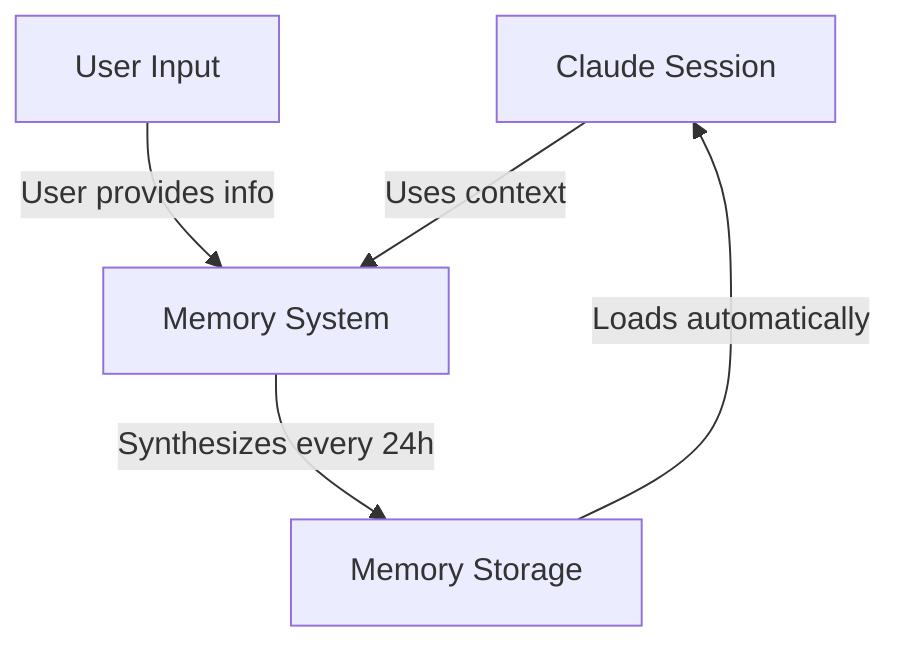
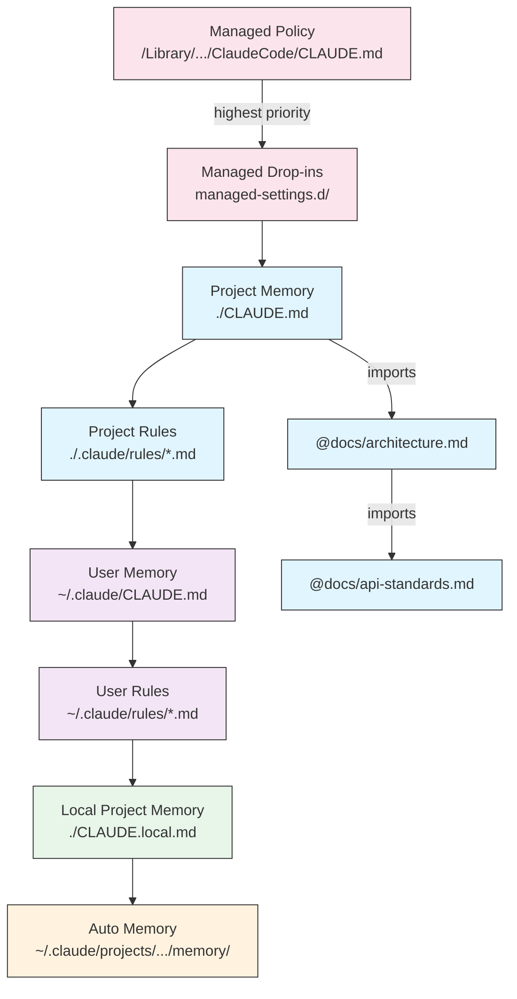
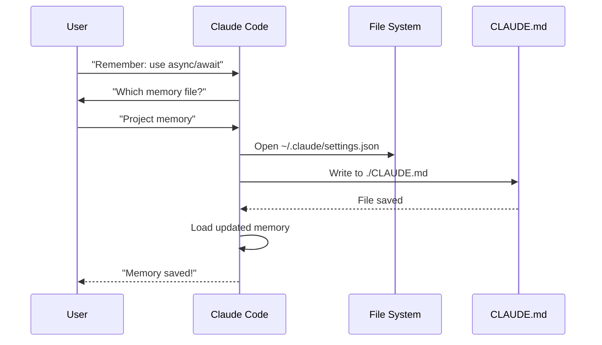
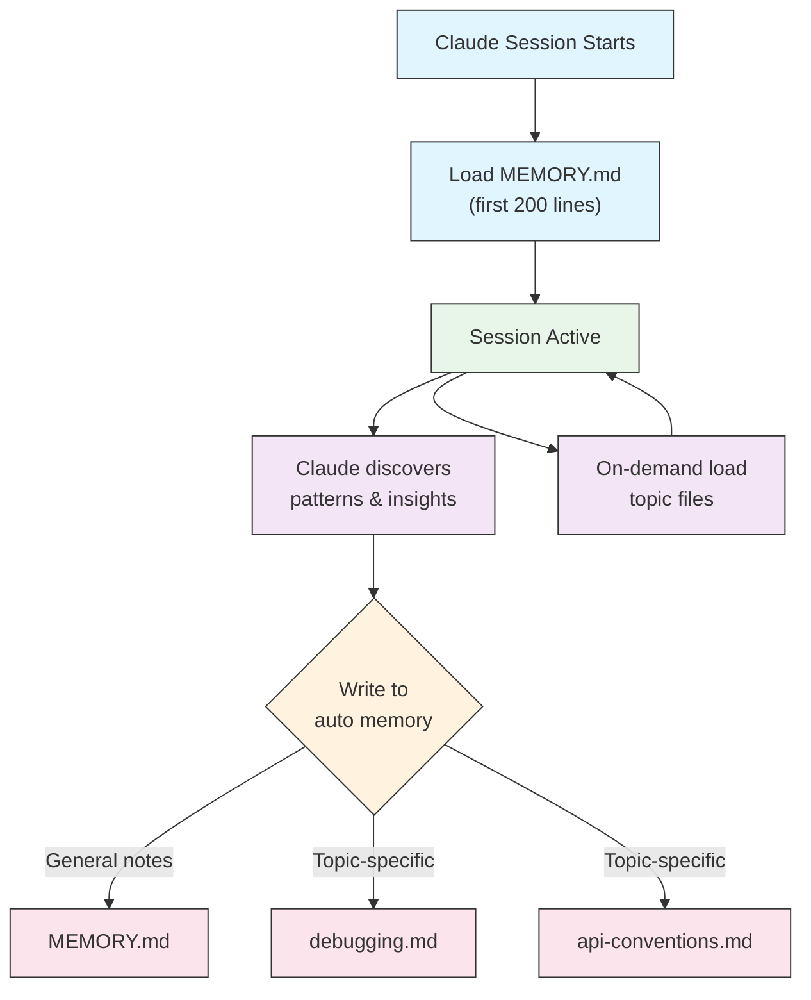

<picture>
  <source media="(prefers-color-scheme: dark)" srcset="../resources/logos/claude-howto-logo-dark.svg">
  
</picture>

# 记忆指南

记忆使 Claude 能够在多个会话和对话中保留上下文。它以两种形式存在：claude.ai 中的自动综合，以及 Claude Code 中基于文件系统的 CLAUDE.md。

## 概述

Claude Code 中的记忆提供跨多个会话和对话持久化的上下文。与临时的上下文窗口不同，记忆文件允许你：

- 在团队中共享项目标准
- 存储个人开发偏好
- 维护特定目录的规则和配置
- 导入外部文档
- 将记忆作为项目的一部分进行版本控制

记忆系统在多个层级上运行，从全局个人偏好到特定的子目录，允许对 Claude 记住的内容及其如何应用这些知识进行细粒度控制。

## 记忆命令快速参考

| 命令 | 用途 | 用法 | 使用时机 |
|---------|---------|-------|-------------|
| `/init` | 初始化项目记忆 | `/init` | 开始新项目、首次设置 CLAUDE.md |
| `/memory` | 在编辑器中编辑记忆文件 | `/memory` | 大量更新、重组、审查内容 |
| `#` 前缀 | 快速单行记忆添加 | `# Your rule here` | 在对话中快速添加规则 |
| `# new rule into memory` | 显式记忆添加 | `# new rule into memory<br/>Your detailed rule` | 添加复杂的多行规则 |
| `# remember this` | 自然语言记忆 | `# remember this<br/>Your instruction` | 对话式记忆更新 |
| `@path/to/file` | 导入外部内容 | `@README.md` 或 `@docs/api.md` | 在 CLAUDE.md 中引用现有文档 |

## 快速开始：初始化记忆

### `/init` 命令

`/init` 命令是在 Claude Code 中设置项目记忆的最快方式。它初始化一个 CLAUDE.md 文件，包含基础项目文档。

**用法：**

```bash
/init
```

**功能：**

- 在项目中创建新的 CLAUDE.md 文件（通常位于 `./CLAUDE.md` 或 `./.claude/CLAUDE.md`）
- 建立项目约定和指南
- 为跨会话的上下文持久化奠定基础
- 提供记录项目标准的模板结构

**增强的交互模式：** 设置 `CLAUDE_CODE_NEW_INIT=true` 可启用多阶段交互流程，逐步引导你完成项目设置：

```bash
CLAUDE_CODE_NEW_INIT=true claude
/init
```

**何时使用 `/init`：**

- 使用 Claude Code 开始新项目
- 建立团队编码标准和约定
- 创建关于代码库结构的文档
- 为协作开发设置记忆层级

**示例工作流：**

```markdown
# In your project directory
/init

# Claude creates CLAUDE.md with structure like:
# Project Configuration
## Project Overview
- Name: Your Project
- Tech Stack: [Your technologies]
- Team Size: [Number of developers]

## Development Standards
- Code style preferences
- Testing requirements
- Git workflow conventions
```

### 使用 `#` 快速更新记忆

在任何对话中，你可以通过以 `#` 开头来快速向记忆添加信息：

**语法：**

```markdown
# Your memory rule or instruction here
```

**示例：**

```markdown
# Always use TypeScript strict mode in this project

# Prefer async/await over promise chains

# Run npm test before every commit

# Use kebab-case for file names
```

**工作原理：**

1. 用 `#` 后跟规则来开始你的消息
2. Claude 将其识别为记忆更新请求
3. Claude 询问要更新哪个记忆文件（项目或个人）
4. 规则被添加到相应的 CLAUDE.md 文件
5. 未来的会话自动加载此上下文

**替代模式：**

```markdown
# new rule into memory
Always validate user input with Zod schemas

# remember this
Use semantic versioning for all releases

# add to memory
Database migrations must be reversible
```

### `/memory` 命令

`/memory` 命令提供直接访问，在 Claude Code 会话中编辑 CLAUDE.md 记忆文件。它在你的系统编辑器中打开记忆文件。

**用法：**

```bash
/memory
```

**功能：**

- 在系统默认编辑器中打开记忆文件
- 允许进行大量添加、修改和重组
- 提供对层级中所有记忆文件的直接访问
- 支持跨会话持久化上下文的维护

**何时使用 `/memory`：**

- 审查现有记忆内容
- 大量更新项目标准
- 重组记忆结构
- 添加详细的文档或指南
- 随着项目发展维护和更新记忆

**比较：`/memory` vs `/init`**

| 方面 | `/memory` | `/init` |
|--------|-----------|---------|
| **用途** | 编辑现有记忆文件 | 初始化新的 CLAUDE.md |
| **使用时机** | 更新/修改项目上下文 | 开始新项目 |
| **操作** | 打开编辑器进行更改 | 生成启动模板 |
| **工作流** | 持续维护 | 一次性设置 |

**示例工作流：**

```markdown
# Open memory for editing
/memory

# Claude presents options:
# 1. Managed Policy Memory
# 2. Project Memory (./CLAUDE.md)
# 3. User Memory (~/.claude/CLAUDE.md)
# 4. Local Project Memory

# Choose option 2 (Project Memory)
# Your default editor opens with ./CLAUDE.md content

# Make changes, save, and close editor
# Claude automatically reloads the updated memory
```

**使用记忆导入：**

CLAUDE.md 文件支持 `@path/to/file` 语法来包含外部内容：

```markdown
# Project Documentation
See @README.md for project overview
See @package.json for available npm commands
See @docs/architecture.md for system design

# Import from home directory using absolute path
@~/.claude/my-project-instructions.md
```

**导入功能：**

- 支持相对路径和绝对路径（如 `@docs/api.md` 或 `@~/.claude/my-project-instructions.md`）
- 支持递归导入，最大深度为 5
- 首次从外部位置导入会触发安全审批对话框
- 在 markdown 代码片段或代码块内不评估导入指令（因此在示例中记录它们是安全的）
- 通过引用现有文档帮助避免重复
- 自动将引用内容包含在 Claude 的上下文中

## 记忆架构

Claude Code 中的记忆遵循分层系统，不同作用域服务于不同目的：



## Claude Code 中的记忆层级

Claude Code 使用多层级分层记忆系统。记忆文件在 Claude Code 启动时自动加载，较高层级的文件优先。

**完整记忆层级（按优先级顺序）：**

1. **托管策略** — 组织范围的指令
   - macOS：`/Library/Application Support/ClaudeCode/CLAUDE.md`
   - Linux/WSL：`/etc/claude-code/CLAUDE.md`
   - Windows：`C:\Program Files\ClaudeCode\CLAUDE.md`

2. **托管补充** — 按字母顺序合并的策略文件（v2.1.83+）
   - `managed-settings.d/` 目录，与托管策略 CLAUDE.md 同级
   - 文件按字母顺序合并，用于模块化策略管理

3. **项目记忆** — 团队共享上下文（版本控制）
   - `./.claude/CLAUDE.md` 或 `./CLAUDE.md`（在仓库根目录）

4. **项目规则** — 模块化、主题特定的项目指令
   - `./.claude/rules/*.md`

5. **用户记忆** — 个人偏好（所有项目）
   - `~/.claude/CLAUDE.md`

6. **用户级规则** — 个人规则（所有项目）
   - `~/.claude/rules/*.md`

7. **本地项目记忆** — 个人项目特定偏好
   - `./CLAUDE.local.md`

> **注意**：`CLAUDE.local.md` 未在 [官方文档](https://code.claude.com/docs/en/memory) 中提及（截至 2026 年 3 月）。它可能作为遗留功能仍然有效。对于新项目，考虑使用 `~/.claude/CLAUDE.md`（用户级）或 `.claude/rules/`（项目级，路径作用域）。

8. **自动记忆** — Claude 的自动笔记和学习
   - `~/.claude/projects/<project>/memory/`

**记忆发现行为：**

Claude 按此顺序搜索记忆文件，较早的位置优先：



## 使用 `claudeMdExcludes` 排除 CLAUDE.md 文件

在大型 monorepo 中，某些 CLAUDE.md 文件可能与当前工作无关。`claudeMdExcludes` 设置允许你跳过特定的 CLAUDE.md 文件，使其不被加载到上下文中：

```jsonc
// In ~/.claude/settings.json or .claude/settings.json
{
  "claudeMdExcludes": [
    "packages/legacy-app/CLAUDE.md",
    "vendors/**/CLAUDE.md"
  ]
}
```

模式与项目根目录的相对路径匹配。这特别适用于：

- 具有多个子项目但只有部分相关的 monorepo
- 包含供应商或第三方 CLAUDE.md 文件的仓库
- 通过排除过时或不相关指令来减少 Claude 上下文窗口中的噪音

## 设置文件层级

Claude Code 设置（包括 `autoMemoryDirectory`、`claudeMdExcludes` 和其他配置）从五级层级解析，较高层级优先：

| 层级 | 位置 | 作用域 |
|-------|----------|--------|
| 1（最高） | 托管策略（系统级） | 组织范围强制执行 |
| 2 | `managed-settings.d/`（v2.1.83+） | 模块化策略补充，按字母顺序合并 |
| 3 | `~/.claude/settings.json` | 用户偏好 |
| 4 | `.claude/settings.json` | 项目级（提交到 git） |
| 5（最低） | `.claude/settings.local.json` | 本地覆盖（git 忽略） |

**平台特定配置（v2.1.51+）：**

设置也可以通过以下方式配置：
- **macOS**：属性列表（plist）文件
- **Windows**：Windows 注册表

这些平台原生机制与 JSON 设置文件一起读取，并遵循相同的优先级规则。

## 模块化规则系统

使用 `.claude/rules/` 目录结构创建有组织的、路径特定的规则。规则可以在项目级和用户级定义：

```
your-project/
├── .claude/
│   ├── CLAUDE.md
│   └── rules/
│       ├── code-style.md
│       ├── testing.md
│       ├── security.md
│       └── api/                  # 支持子目录
│           ├── conventions.md
│           └── validation.md

~/.claude/
├── CLAUDE.md
└── rules/                        # 用户级规则（所有项目）
    ├── personal-style.md
    └── preferred-patterns.md
```

规则在 `rules/` 目录中被递归发现，包括任何子目录。`~/.claude/rules/` 中的用户级规则在项目级规则之前加载，允许个人默认值，项目可以覆盖。

### 使用 YAML Frontmatter 的路径特定规则

定义仅适用于特定文件路径的规则：

```markdown
---
paths: src/api/**/*.ts
---

# API Development Rules

- All API endpoints must include input validation
- Use Zod for schema validation
- Document all parameters and response types
- Include error handling for all operations
```

**Glob 模式示例：**

- `**/*.ts` — 所有 TypeScript 文件
- `src/**/*` — src/ 下的所有文件
- `src/**/*.{ts,tsx}` — 多个扩展名
- `{src,lib}/**/*.ts, tests/**/*.test.ts` — 多个模式

### 子目录和符号链接

`.claude/rules/` 中的规则支持两种组织功能：

- **子目录**：规则被递归发现，因此你可以将它们组织成基于主题的文件夹（例如 `rules/api/`、`rules/testing/`、`rules/security/`）
- **符号链接**：支持跨多个项目共享规则。例如，你可以从中央位置将共享规则文件符号链接到每个项目的 `.claude/rules/` 目录中

## 记忆位置表

| 位置 | 作用域 | 优先级 | 共享 | 访问 | 适用于 |
|----------|-------|----------|--------|--------|----------|
| `/Library/Application Support/ClaudeCode/CLAUDE.md`（macOS） | 托管策略 | 1（最高） | 组织 | 系统 | 公司范围策略 |
| `/etc/claude-code/CLAUDE.md`（Linux/WSL） | 托管策略 | 1（最高） | 组织 | 系统 | 组织标准 |
| `C:\Program Files\ClaudeCode\CLAUDE.md`（Windows） | 托管策略 | 1（最高） | 组织 | 系统 | 企业指南 |
| `managed-settings.d/*.md`（与策略同级） | 托管补充 | 1.5 | 组织 | 系统 | 模块化策略文件（v2.1.83+） |
| `./CLAUDE.md` 或 `./.claude/CLAUDE.md` | 项目记忆 | 2 | 团队 | Git | 团队标准、共享架构 |
| `./.claude/rules/*.md` | 项目规则 | 3 | 团队 | Git | 路径特定、模块化规则 |
| `~/.claude/CLAUDE.md` | 用户记忆 | 4 | 个人 | 文件系统 | 个人偏好（所有项目） |
| `~/.claude/rules/*.md` | 用户规则 | 5 | 个人 | 文件系统 | 个人规则（所有项目） |
| `./CLAUDE.local.md` | 本地项目 | 6 | 个人 | Git（忽略） | 个人项目特定偏好 |
| `~/.claude/projects/<project>/memory/` | 自动记忆 | 7（最低） | 个人 | 文件系统 | Claude 的自动笔记和学习 |

## 记忆更新生命周期

以下是你的记忆更新如何流经 Claude Code 会话：



## 自动记忆

自动记忆是一个持久化目录，Claude 在与你的项目协作时自动记录学习内容、模式和改进。与你手动编写和维护的 CLAUDE.md 文件不同，自动记忆由 Claude 本身在会话期间编写。

### 自动记忆工作原理

- **位置**：`~/.claude/projects/<project>/memory/`
- **入口文件**：`MEMORY.md` 作为自动记忆目录中的主文件
- **主题文件**：可选的特定主题附加文件（例如 `debugging.md`、`api-conventions.md`）
- **加载行为**：`MEMORY.md` 的前 200 行在会话开始时加载到系统提示词中。主题文件按需加载，不在启动时加载
- **读/写**：Claude 在会话期间读写记忆文件，发现模式和项目特定知识

### 自动记忆架构



### 自动记忆目录结构

```
~/.claude/projects/<project>/memory/
├── MEMORY.md              # 入口文件（启动时加载前 200 行）
├── debugging.md           # 主题文件（按需加载）
├── api-conventions.md     # 主题文件（按需加载）
└── testing-patterns.md    # 主题文件（按需加载）
```

### 版本要求

自动记忆需要 **Claude Code v2.1.59 或更高版本**。如果你使用的是旧版本，请先升级：

```bash
npm install -g @anthropic-ai/claude-code@latest
```

### 自定义自动记忆目录

默认情况下，自动记忆存储在 `~/.claude/projects/<project>/memory/`。你可以使用 `autoMemoryDirectory` 设置更改此位置（自 **v2.1.74** 起可用）：

```jsonc
// In ~/.claude/settings.json or .claude/settings.local.json (user/local settings only)
{
  "autoMemoryDirectory": "/path/to/custom/memory/directory"
}
```

> **注意**：`autoMemoryDirectory` 只能在用户级（`~/.claude/settings.json`）或本地设置（`.claude/settings.local.json`）中设置，不能在项目或托管策略设置中设置。

这在你想要以下情况下很有用：

- 将自动记忆存储在共享或同步的位置
- 将自动记忆与默认的 Claude 配置目录分开
- 在默认层级之外使用项目特定路径

### 工作树和仓库共享

同一 git 仓库内的所有工作树和子目录共享一个自动记忆目录。这意味着在工作树之间切换或在同一个仓库的不同子目录中工作，将读写相同的记忆文件。

### 子代理记忆

子代理（通过 Task 或并行执行等工具生成）可以有自己的记忆上下文。使用子代理定义中的 `memory` frontmatter 字段指定要加载哪些记忆作用域：

```yaml
memory: user      # 仅加载用户级记忆
memory: project   # 仅加载项目级记忆
memory: local     # 仅加载本地记忆
```

这允许子代理在集中上下文中操作，而不是继承完整的记忆层级。

### 控制自动记忆

自动记忆可以通过 `CLAUDE_CODE_DISABLE_AUTO_MEMORY` 环境变量控制：

| 值 | 行为 |
|-------|---------|
| `0` | 强制开启自动记忆 |
| `1` | 强制关闭自动记忆 |
| *（未设置）* | 默认行为（启用自动记忆） |

```bash
# 禁用会话的自动记忆
CLAUDE_CODE_DISABLE_AUTO_MEMORY=1 claude

# 显式强制开启自动记忆
CLAUDE_CODE_DISABLE_AUTO_MEMORY=0 claude
```

## 使用 `--add-dir` 的附加目录

`--add-dir` 标志允许 Claude Code 从当前工作目录以外的附加目录加载 CLAUDE.md 文件。这在 monorepo 或多项目设置中很有用，在这些场景中其他目录的上下文是相关的。

要启用此功能，设置环境变量：

```bash
CLAUDE_CODE_ADDITIONAL_DIRECTORIES_CLAUDE_MD=1
```

然后使用该标志启动 Claude Code：

```bash
claude --add-dir /path/to/other/project
```

Claude 将从指定的附加目录以及当前工作目录的记忆文件加载 CLAUDE.md。

## 实用示例

### 示例 1：项目记忆结构

**文件：** `./CLAUDE.md`

```markdown
# Project Configuration

## Project Overview
- **Name**: E-commerce Platform
- **Tech Stack**: Node.js, PostgreSQL, React 18, Docker
- **Team Size**: 5 developers
- **Deadline**: Q4 2025

## Architecture
@docs/architecture.md
@docs/api-standards.md
@docs/database-schema.md

## Development Standards

### Code Style
- Use Prettier for formatting
- Use ESLint with airbnb config
- Maximum line length: 100 characters
- Use 2-space indentation

### Naming Conventions
- **Files**: kebab-case (user-controller.js)
- **Classes**: PascalCase (UserService)
- **Functions/Variables**: camelCase (getUserById)
- **Constants**: UPPER_SNAKE_CASE (API_BASE_URL)
- **Database Tables**: snake_case (user_accounts)

### Git Workflow
- Branch names: `feature/description` or `fix/description`
- Commit messages: Follow conventional commits
- PR required before merge
- All CI/CD checks must pass
- Minimum 1 approval required

### Testing Requirements
- Minimum 80% code coverage
- All critical paths must have tests
- Use Jest for unit tests
- Use Cypress for E2E tests
- Test filenames: `*.test.ts` or `*.spec.ts`

### API Standards
- RESTful endpoints only
- JSON request/response
- Use HTTP status codes correctly
- Version API endpoints: `/api/v1/`
- Document all endpoints with examples

### Database
- Use migrations for schema changes
- Never hardcode credentials
- Use connection pooling
- Enable query logging in development
- Regular backups required

### Deployment
- Docker-based deployment
- Kubernetes orchestration
- Blue-green deployment strategy
- Automatic rollback on failure
- Database migrations run before deploy

## Common Commands

| Command | Purpose |
|---------|---------|
| `npm run dev` | Start development server |
| `npm test` | Run test suite |
| `npm run lint` | Check code style |
| `npm run build` | Build for production |
| `npm run migrate` | Run database migrations |

## Team Contacts
- Tech Lead: Sarah Chen (@sarah.chen)
- Product Manager: Mike Johnson (@mike.j)
- DevOps: Alex Kim (@alex.k)

## Known Issues & Workarounds
- PostgreSQL connection pooling limited to 20 during peak hours
- Workaround: Implement query queuing
- Safari 14 compatibility issues with async generators
- Workaround: Use Babel transpiler

## Related Projects
- Analytics Dashboard: `/projects/analytics`
- Mobile App: `/projects/mobile`
- Admin Panel: `/projects/admin`
```

### 示例 2：特定目录记忆

**文件：** `./src/api/CLAUDE.md`

```markdown
# API Module Standards

This file overrides root CLAUDE.md for everything in /src/api/

## API-Specific Standards

### Request Validation
- Use Zod for schema validation
- Always validate input
- Return 400 with validation errors
- Include field-level error details

### Authentication
- All endpoints require JWT token
- Token in Authorization header
- Token expires after 24 hours
- Implement refresh token mechanism

### Response Format

All responses must follow this structure:

```json
{
  "success": true,
  "data": { /* actual data */ },
  "timestamp": "2025-11-06T10:30:00Z",
  "version": "1.0"
}
```

Error responses:
```json
{
  "success": false,
  "error": {
    "code": "VALIDATION_ERROR",
    "message": "User message",
    "details": { /* field errors */ }
  },
  "timestamp": "2025-11-06T10:30:00Z"
}
```

### Pagination
- Use cursor-based pagination (not offset)
- Include `hasMore` boolean
- Limit max page size to 100
- Default page size: 20

### Rate Limiting
- 1000 requests per hour for authenticated users
- 100 requests per hour for public endpoints
- Return 429 when exceeded
- Include retry-after header

### Caching
- Use Redis for session caching
- Cache duration: 5 minutes default
- Invalidate on write operations
- Tag cache keys with resource type
```

### 示例 3：个人记忆

**文件：** `~/.claude/CLAUDE.md`

```markdown
# My Development Preferences

## About Me
- **Experience Level**: 8 years full-stack development
- **Preferred Languages**: TypeScript, Python
- **Communication Style**: Direct, with examples
- **Learning Style**: Visual diagrams with code

## Code Preferences

### Error Handling
I prefer explicit error handling with try-catch blocks and meaningful error messages.
Avoid generic errors. Always log errors for debugging.

### Comments
Use comments for WHY, not WHAT. Code should be self-documenting.
Comments should explain business logic or non-obvious decisions.

### Testing
I prefer TDD (test-driven development).
Write tests first, then implementation.
Focus on behavior, not implementation details.

### Architecture
I prefer modular, loosely-coupled design.
Use dependency injection for testability.
Separate concerns (Controllers, Services, Repositories).

## Debugging Preferences
- Use console.log with prefix: `[DEBUG]`
- Include context: function name, relevant variables
- Use stack traces when available
- Always include timestamps in logs

## Communication
- Explain complex concepts with diagrams
- Show concrete examples before explaining theory
- Include before/after code snippets
- Summarize key points at the end

## Project Organization
I organize my projects as:

   project/
   ├── src/
   │   ├── api/
   │   ├── services/
   │   ├── models/
   │   └── utils/
   ├── tests/
   ├── docs/
   └── docker/

## Tooling
- **IDE**: VS Code with vim keybindings
- **Terminal**: Zsh with Oh-My-Zsh
- **Format**: Prettier (100 char line length)
- **Linter**: ESLint with airbnb config
- **Test Framework**: Jest with React Testing Library
```

_My Test_
Ask Claude to save a new rule


Claude has not save the rule because I did not have any `Claude.md` file anywhere. Then asked Claude to confirm the location.


### 示例 4：会话期间更新记忆

你可以在活动的 Claude Code 会话中向记忆添加新规则。有两种方式：

#### 方法 1：直接请求

```markdown
User: Remember that I prefer using React hooks instead of class components
     for all new components.

Claude: I'm adding that to your memory. Which memory file should this go in?
        1. Project memory (./CLAUDE.md)
        2. Personal memory (~/.claude/CLAUDE.md)

User: Project memory

Claude: ✅ Memory saved!

Added to ./CLAUDE.md:
---

### Component Development
- Use functional components with React Hooks
- Prefer hooks over class components
- Custom hooks for reusable logic
- Use useCallback for event handlers
- Use useMemo for expensive computations
```

#### 方法 2：使用"# new rule into memory"模式

你也可以使用显式模式"# new rule into memory"来触发记忆更新：

```markdown
User: # new rule into memory
      Always validate user input with Zod schemas before processing.

Claude: I'm saving this rule to memory. Which memory file should I use?
        1. Project memory (./CLAUDE.md)
        2. Personal memory (~/.claude/CLAUDE.md)

User: Project memory

Claude: ✅ Memory saved!

Added to ./CLAUDE.md:
---

### Input Validation
- Always validate user input with Zod schemas before processing
- Define schemas at the top of each API handler file
- Return 400 status with validation errors
```

#### 添加记忆的技巧

- 在规则中要具体且可操作
- 将相关规则分组在同一个部分标题下
- 更新现有部分而不是复制内容
- 选择适当的作用域（项目 vs. 个人）

## 记忆功能比较

| 功能 | Claude Web/Desktop | Claude Code（CLAUDE.md） |
|---------|-------------------|------------------------|
| 自动综合 | ✅ 每 24 小时 | ❌ 手动 |
| 跨项目 | ✅ 共享 | ❌ 项目特定 |
| 团队访问 | ✅ 共享项目 | ✅ Git 跟踪 |
| 可搜索 | ✅ 内置 | ✅ 通过 `/memory` |
| 可编辑 | ✅ 聊天内 | ✅ 直接文件编辑 |
| 导入/导出 | ✅ 是 | ✅ 复制/粘贴 |
| 持久化 | ✅ 24 小时以上 | ✅ 无限期 |

### Claude Web/Desktop 中的记忆

#### 记忆综合时间线


**记忆摘要示例：**

```markdown
## Claude's Memory of User

### Professional Background
- Senior full-stack developer with 8 years experience
- Focus on TypeScript/Node.js backends and React frontends
- Active open source contributor
- Interested in AI and machine learning

### Project Context
- Currently building e-commerce platform
- Tech stack: Node.js, PostgreSQL, React 18, Docker
- Working with team of 5 developers
- Using CI/CD and blue-green deployments

### Communication Preferences
- Prefers direct, concise explanations
- Likes visual diagrams and examples
- Appreciates code snippets
- Explains business logic in comments

### Current Goals
- Improve API performance
- Increase test coverage to 90%
- Implement caching strategy
- Document architecture
```

## 最佳实践

### 应该做 — 包含什么

- **要具体且详细**：使用清晰、详细的指令而非模糊的指导
  - ✅ 好："所有 JavaScript 文件使用 2 空格缩进"
  - ❌ 避免："遵循最佳实践"

- **保持有组织**：用清晰的 markdown 部分和标题组织记忆文件

- **使用适当的层级**：
  - **托管策略**：公司范围策略、安全标准、合规要求
  - **项目记忆**：团队标准、架构、编码约定（提交到 git）
  - **用户记忆**：个人偏好、沟通风格、工具选择
  - **目录记忆**：模块特定规则和覆盖

- **利用导入**：使用 `@path/to/file` 语法引用现有文档
  - 支持最多 5 层递归嵌套
  - 避免记忆文件之间的重复
  - 示例：`See @README.md for project overview`

- **记录常用命令**：包含你重复使用的命令以节省时间

- **版本控制项目记忆**：将项目级 CLAUDE.md 文件提交到 git 以使团队受益

- **定期审查**：随着项目发展和需求变化更新记忆

- **提供具体示例**：包含代码片段和特定场景

### 不应该做 — 避免什么

- **不要存储密钥**：切勿包含 API 密钥、密码、令牌或凭据

- **不要包含敏感数据**：不要包含 PII、私人信息或专有密钥

- **不要复制内容**：使用导入（`@path`）引用现有文档而不是复制

- **不要太模糊**：避免"遵循最佳实践"或"写好代码"等通用表述

- **不要写得太长**：保持单个记忆文件集中且少于 500 行

- **不要过度组织**：战略性使用层级；不要创建过多的子目录覆盖

- **不要忘记更新**：过时的记忆会导致混淆和过时的实践

- **不要超过嵌套限制**：记忆导入支持最多 5 层嵌套

### 记忆管理技巧

**选择正确的记忆级别：**

| 使用场景 | 记忆级别 | 理由 |
|----------|-------------|-----------|
| 公司安全策略 | 托管策略 | 适用于所有项目，组织范围 |
| 团队代码风格指南 | 项目 | 通过 git 与团队共享 |
| 你喜欢的编辑器快捷键 | 用户 | 个人偏好，不共享 |
| API 模块标准 | 目录 | 仅适用于该模块 |

**快速更新工作流：**

1. 对于单个规则：在对话中使用 `#` 前缀
2. 对于多次更改：使用 `/memory` 打开编辑器
3. 对于初始设置：使用 `/init` 创建模板

**导入最佳实践：**

```markdown
# Good: Reference existing docs
@README.md
@docs/architecture.md
@package.json

# Avoid: Copying content that exists elsewhere
# Instead of copying README content into CLAUDE.md, just import it
```

## 安装说明

### 设置项目记忆

#### 方法 1：使用 `/init` 命令（推荐）

最快设置项目记忆的方式：

1. **导航到你的项目目录：**
   ```bash
   cd /path/to/your/project
   ```

2. **在 Claude Code 中运行 init 命令：**
   ```bash
   /init
   ```

3. **Claude 将创建并填充 CLAUDE.md**，包含模板结构

4. **自定义生成的文件**以匹配你的项目需求

5. **提交到 git：**
   ```bash
   git add CLAUDE.md
   git commit -m "Initialize project memory with /init"
   ```

#### 方法 2：手动创建

如果你更喜欢手动设置：

1. **在项目根目录创建 CLAUDE.md：**
   ```bash
   cd /path/to/your/project
   touch CLAUDE.md
   ```

2. **添加项目标准：**
   ```bash
   cat > CLAUDE.md << 'EOF'
   # Project Configuration

   ## Project Overview
   - **Name**: Your Project Name
   - **Tech Stack**: List your technologies
   - **Team Size**: Number of developers

   ## Development Standards
   - Your coding standards
   - Naming conventions
   - Testing requirements
   EOF
   ```

3. **提交到 git：**
   ```bash
   git add CLAUDE.md
   git commit -m "Add project memory configuration"
   ```

#### 方法 3：使用 `#` 快速更新

一旦 CLAUDE.md 存在，在对话中快速添加规则：

```markdown
# Use semantic versioning for all releases

# Always run tests before committing

# Prefer composition over inheritance
```

Claude 会提示你选择要更新哪个记忆文件。

### 设置个人记忆

1. **创建 ~/.claude 目录：**
   ```bash
   mkdir -p ~/.claude
   ```

2. **创建个人 CLAUDE.md：**
   ```bash
   touch ~/.claude/CLAUDE.md
   ```

3. **添加你的偏好：**
   ```bash
   cat > ~/.claude/CLAUDE.md << 'EOF'
   # My Development Preferences

   ## About Me
   - Experience Level: [Your level]
   - Preferred Languages: [Your languages]
   - Communication Style: [Your style]

   ## Code Preferences
   - [Your preferences]
   EOF
   ```

### 设置特定目录记忆

1. **为特定目录创建记忆：**
   ```bash
   mkdir -p /path/to/directory/.claude
   touch /path/to/directory/CLAUDE.md
   ```

2. **添加特定目录规则：**
   ```bash
   cat > /path/to/directory/CLAUDE.md << 'EOF'
   # [Directory Name] Standards

   This file overrides root CLAUDE.md for this directory.

   ## [Specific Standards]
   EOF
   ```

3. **提交到版本控制：**
   ```bash
   git add /path/to/directory/CLAUDE.md
   git commit -m "Add [directory] memory configuration"
   ```

### 验证设置

1. **检查记忆位置：**
   ```bash
   # Project root memory
   ls -la ./CLAUDE.md

   # Personal memory
   ls -la ~/.claude/CLAUDE.md
   ```

2. **Claude Code 启动时会自动加载**这些文件

3. **用 Claude Code 测试**，在你的项目中开始新会话

## 官方文档

有关最新信息，请参阅官方 Claude Code 文档：

- **[记忆文档](https://code.claude.com/docs/en/memory)** — 完整的记忆系统参考
- **[斜杠命令参考](https://code.claude.com/docs/en/interactive-mode)** — 所有内置命令，包括 `/init` 和 `/memory`
- **[CLI 参考](https://code.claude.com/docs/en/cli-reference)** — 命令行界面文档

### 来自官方文档的关键技术细节

**记忆加载：**

- 所有记忆文件在 Claude Code 启动时自动加载
- Claude 从当前工作目录向上遍历以发现 CLAUDE.md 文件
- 子树文件在访问这些目录时按上下文被发现和加载

**导入语法：**

- 使用 `@path/to/file` 包含外部内容（例如 `@~/.claude/my-project-instructions.md`）
- 支持相对路径和绝对路径
- 支持递归导入，最大深度为 5
- 首次外部导入会触发审批对话框
- 不在 markdown 代码片段或代码块内评估
- 自动将引用内容包含在 Claude 的上下文中

**记忆层级优先级：**

1. 托管策略（最高优先级）
2. 托管补充（`managed-settings.d/`，v2.1.83+）
3. 项目记忆
4. 项目规则（`.claude/rules/`）
5. 用户记忆
6. 用户级规则（`~/.claude/rules/`）
7. 本地项目记忆
8. 自动记忆（最低优先级）

## 相关概念链接

### 集成点
- [MCP 协议](../05-mcp/) — 与记忆一起的实时数据访问
- [斜杠命令](../01-slash-commands/) — 会话特定的快捷方式
- [技能](../03-skills/) — 带记忆上下文的自动化工作流

### 相关 Claude 功能
- [Claude Web Memory](https://claude.ai) — 自动综合
- [官方记忆文档](https://code.claude.com/docs/en/memory) — Anthropic 文档
