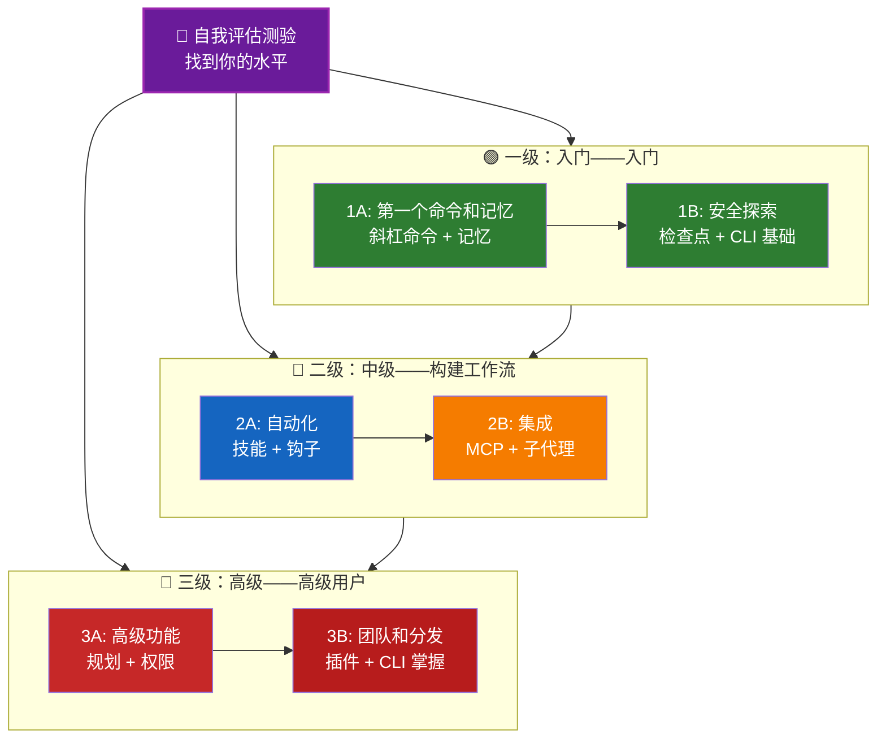

<picture>
  <source media="(prefers-color-scheme: dark)" srcset="resources/logos/claude-howto-logo-dark.svg">
  
</picture>

# Claude Code 学习路线图

**初次接触 Claude Code？** 本指南帮助你按自己的节奏掌握 Claude Code 功能。无论你是完全的初学者还是有经验的开发者，都可以从下面的自我评估测验开始，找到适合你的路径。

---

## 找到你的水平

不是每个人起点都一样。参加这个快速自我评估，找到合适的入口。

**诚实回答这些问题：**

- [ ] 我可以启动 Claude Code 并进行对话（`claude`）
- [ ] 我创建或编辑过 CLAUDE.md 文件
- [ ] 我使用过至少 3 个内置斜杠命令（例如 /help、/compact、/model）
- [ ] 我创建过自定义斜杠命令或技能（SKILL.md）
- [ ] 我配置过 MCP 服务器（例如 GitHub、数据库）
- [ ] 我在 ~/.claude/settings.json 中设置过钩子
- [ ] 我创建或使用过自定义子代理（.claude/agents/）
- [ ] 我使用过打印模式（`claude -p`）进行脚本编写或 CI/CD

**你的水平：**

| 勾选数 | 水平 | 从这里开始 | 完成时间 |
|--------|-------|----------|------------------|
| 0-2 | **一级：入门——入门** | [里程碑 1A](#里程碑-1a-第一个命令和记忆) | 约 3 小时 |
| 3-5 | **二级：中级——构建工作流** | [里程碑 2A](#里程碑-2a-自动化技能--钩子) | 约 5 小时 |
| 6-8 | **三级：高级——高级用户和团队负责人** | [里程碑 3A](#里程碑-3a-高级功能) | 约 5 小时 |

> **提示**：如果不确定，从低一级别开始。快速复习熟悉的材料比错过基础知识要好。

> **交互版本**：在 Claude Code 中运行 `/self-assessment`，获取涵盖所有 10 个功能领域的引导式互动测验，并生成个性化学习路径。

---

## 学习理念

本仓库中的文件夹按**推荐学习顺序**编号，基于三个关键原则：

1. **依赖关系** - 先学基础概念
2. **复杂度** - 简单功能在高级功能之前
3. **使用频率** - 最常用的功能先教

这种方法确保你在获得即时生产力收益的同时打下坚实基础。

---

## 你的学习路径



**颜色图例：**
- 紫色：自我评估测验
- 绿色：一级——入门路径
- 蓝色/金色：二级——中级路径
- 红色：三级——高级路径

---

## 完整路线图表

| 步骤 | 功能 | 复杂度 | 时间 | 级别 | 依赖 | 为什么学这个 | 关键收益 |
|------|---------|-----------|------|-------|--------------|----------------|--------------|
| **1** | [斜杠命令](01-slash-commands/) | ⭐ 入门 | 30 分钟 | 一级 | 无 | 快速获得生产力（55+ 内置 + 5 个捆绑技能） | 即时自动化、团队标准 |
| **2** | [记忆](02-memory/) | ⭐⭐ 入门+ | 45 分钟 | 一级 | 无 | 所有功能的必要基础 | 持久上下文、偏好设置 |
| **3** | [检查点](08-checkpoints/) | ⭐⭐ 中级 | 45 分钟 | 一级 | 会话管理 | 安全探索 | 实验、恢复 |
| **4** | [CLI 基础](10-cli/) | ⭐⭐ 入门+ | 30 分钟 | 一级 | 无 | 核心 CLI 使用 | 交互和打印模式 |
| **5** | [技能](03-skills/) | ⭐⭐ 中级 | 1 小时 | 二级 | 斜杠命令 | 自动专业知识 | 可复用能力、一致性 |
| **6** | [钩子](06-hooks/) | ⭐⭐ 中级 | 1 小时 | 二级 | 工具、命令 | 工作流自动化（25 个事件，4 种类型） | 验证、质量门禁 |
| **7** | [MCP](05-mcp/) | ⭐⭐⭐ 中级+ | 1 小时 | 二级 | 配置 | 实时数据访问 | 实时集成、API |
| **8** | [子代理](04-subagents/) | ⭐⭐⭐ 中级+ | 1.5 小时 | 二级 | 记忆、命令 | 复杂任务处理（6 个内置，包括 Bash） | 分配、专业知识 |
| **9** | [高级功能](09-advanced-features/) | ⭐⭐⭐⭐⭐ 高级 | 2-3 小时 | 三级 | 所有之前 | 高级用户工具 | 规划、Auto Mode、频道、语音听写、权限 |
| **10** | [插件](07-plugins/) | ⭐⭐⭐⭐ 高级 | 2 小时 | 三级 | 所有之前 | 完整解决方案 | 团队入职、分发 |
| **11** | [CLI 精通](10-cli/) | ⭐⭐⭐ 高级 | 1 小时 | 三级 | 推荐：所有 | 掌握命令行使用 | 脚本、CI/CD、自动化 |

**总学习时间**：约 11-13 小时（或跳到你的级别以节省时间）

---

## 一级：入门——入门

**适用**：勾选 0-2 个的用户
**时间**：约 3 小时
**重点**：即时生产力、理解基础知识
**成果**：舒适的日常用户，为二级做好准备

### 里程碑 1A：第一个命令和记忆

**主题**：斜杠命令 + 记忆
**时间**：1-2 小时
**复杂度**：⭐ 入门
**目标**：通过自定义命令和持久化上下文获得即时生产力提升

#### 你将实现
✅ 为重复任务创建自定义斜杠命令
✅ 为团队标准设置项目记忆
✅ 配置个人偏好
✅ 理解 Claude 如何自动加载上下文

#### 动手练习

```bash
# 练习 1：安装你的第一个斜杠命令
mkdir -p .claude/commands
cp 01-slash-commands/optimize.md .claude/commands/

# 练习 2：创建项目记忆
cp 02-memory/project-CLAUDE.md ./CLAUDE.md

# 练习 3：试用
# 在 Claude Code 中输入：/optimize
```

#### 成功标准
- [ ] 成功调用 `/optimize` 命令
- [ ] Claude 从 CLAUDE.md 记住你的项目标准
- [ ] 你理解何时使用斜杠命令 vs. 记忆

#### 下一步
熟悉后，阅读：
- [斜杠命令](01-slash-commands/README.zh-CN.md)
- [记忆](02-memory/README.zh-CN.md)

> **检查你的理解**：在 Claude Code 中运行 `/lesson-quiz slash-commands` 或 `/lesson-quiz memory`，测试你所学的内容。

---

### 里程碑 1B：安全探索

**主题**：检查点 + CLI 基础
**时间**：1 小时
**复杂度**：⭐⭐ 入门+
**目标**：学习安全实验的方法和使用核心 CLI 命令

#### 你将实现
✅ 为安全实验创建和恢复检查点
✅ 理解交互模式 vs. 打印模式
✅ 使用基本 CLI 标志和选项
✅ 通过管道处理文件

#### 动手练习

```bash
# 练习 1：试用检查点工作流
# 在 Claude Code 中：
# 进行一些实验性更改，然后按 Esc+Esc 或使用 /rewind
# 选择实验前的检查点
# 选择"恢复代码和对话"返回

# 练习 2：交互模式 vs 打印模式
claude "explain this project"           # 交互模式
claude -p "explain this function"       # 打印模式（非交互）

# 练习 3：通过管道处理文件内容
cat error.log | claude -p "explain this error"
```

#### 成功标准
- [ ] 创建并回退到一个检查点
- [ ] 使用了交互模式和打印模式
- [ ] 将文件通过管道传给 Claude 进行分析
- [ ] 理解何时使用检查点进行安全实验

#### 下一步
- 阅读：[检查点](08-checkpoints/README.zh-CN.md)
- 阅读：[命令行](10-cli/README.zh-CN.md)
- **准备好进入二级！** 继续到[里程碑 2A](#里程碑-2a-自动化技能--钩子)

> **检查你的理解**：运行 `/lesson-quiz checkpoints` 或 `/lesson-quiz cli`，验证你已准备好进入二级。

---

## 二级：中级——构建工作流

**适用**：勾选 3-5 个的用户
**时间**：约 5 小时
**重点**：自动化、集成、任务分配
**成果**：自动化工作流、外部集成，为三级做好准备

### 先决条件检查

在开始二级之前，确保你熟悉以下一级概念：

- [ ] 可以创建和使用斜杠命令（[01-slash-commands/](01-slash-commands/)）
- [ ] 已通过 CLAUDE.md 设置项目记忆（[02-memory/](02-memory/)）
- [ ] 知道如何创建和恢复检查点（[08-checkpoints/](08-checkpoints/)）
- [ ] 可以从命令行使用 `claude` 和 `claude -p`（[10-cli/](10-cli/)）

> **有差距？** 在继续之前复习上面链接的教程。

---

### 里程碑 2A：自动化（技能 + 钩子）

**主题**：技能 + 钩子
**时间**：2-3 小时
**复杂度**：⭐⭐ 中级
**目标**：自动化常见工作流和质量检查

#### 你将实现
✅ 通过 YAML 前置matter（包括 `effort` 和 `shell` 字段）自动调用专业化能力
✅ 跨 25 个钩子事件设置事件驱动自动化
✅ 使用所有 4 种钩子类型（command、http、prompt、agent）
✅ 强制执行代码质量标准
✅ 为你的工作流创建自定义钩子

#### 动手练习

```bash
# 练习 1：安装一个技能
cp -r 03-skills/code-review ~/.claude/skills/

# 练习 2：设置钩子
mkdir -p ~/.claude/hooks
cp 06-hooks/pre-tool-check.sh ~/.claude/hooks/
chmod +x ~/.claude/hooks/pre-tool-check.sh

# 练习 3：在设置中配置钩子
# 添加到 ~/.claude/settings.json：
{
  "hooks": {
    "PreToolUse": [
      {
        "matcher": "Bash",
        "hooks": [
          {
            "type": "command",
            "command": "~/.claude/hooks/pre-tool-check.sh"
          }
        ]
      }
    ]
  }
}
```

#### 成功标准
- [ ] 代码审查技能在相关内容时自动调用
- [ ] PreToolUse 钩子在工具执行前运行
- [ ] 你理解技能自动调用 vs. 钩子事件触发

#### 下一步
- 创建你自己的自定义技能
- 为你的工作流设置其他钩子
- 阅读：[技能](03-skills/README.zh-CN.md)
- 阅读：[钩子](06-hooks/README.zh-CN.md)

> **检查你的理解**：在移动到下一步之前，运行 `/lesson-quiz skills` 或 `/lesson-quiz hooks` 测试你的知识。

---

### 里程碑 2B：集成（MCP + 子代理）

**主题**：MCP + 子代理
**时间**：2-3 小时
**复杂度**：⭐⭐⭐ 中级+
**目标**：集成外部服务并分配复杂任务

#### 你将实现
✅ 从 GitHub、数据库等访问实时数据
✅ 向专业 AI 代理分配工作
✅ 理解何时使用 MCP vs. 子代理
✅ 构建集成工作流

#### 动手练习

```bash
# 练习 1：设置 GitHub MCP
export GITHUB_TOKEN="your_github_token"
claude mcp add github -- npx -y @modelcontextprotocol/server-github

# 练习 2：测试 MCP 集成
# 在 Claude Code 中：/mcp__github__list_prs

# 练习 3：安装子代理
mkdir -p .claude/agents
cp 04-subagents/*.md .claude/agents/
```

#### 集成练习
尝试这个完整工作流：
1. 使用 MCP 获取 GitHub PR
2. 让 Claude 将审查分配给 code-reviewer 子代理
3. 使用钩子自动运行测试

#### 成功标准
- [ ] 通过 MCP 成功查询 GitHub 数据
- [ ] Claude 将复杂任务分配给子代理
- [ ] 你理解 MCP 和子代理之间的区别
- [ ] 在工作流中组合了 MCP + 子代理 + 钩子

#### 下一步
- 设置其他 MCP 服务器（数据库、Slack 等）
- 为你的领域创建自定义子代理
- 阅读：[MCP](05-mcp/README.zh-CN.md)
- 阅读：[子代理](04-subagents/README.zh-CN.md)
- **准备好进入三级！** 继续到[里程碑 3A](#里程碑-3a-高级功能)

> **检查你的理解**：运行 `/lesson-quiz mcp` 或 `/lesson-quiz subagents`，验证你已准备好进入三级。

---

## 三级：高级——高级用户和团队负责人

**适用**：勾选 6-8 个的用户
**时间**：约 5 小时
**重点**：团队工具、CI/CD、企业功能、插件开发
**成果**：高级用户，可设置团队工作流和 CI/CD

### 先决条件检查

在开始三级之前，确保你熟悉以下二级概念：

- [ ] 可以创建和使用带自动调用的技能（[03-skills/](03-skills/)）
- [ ] 已设置事件驱动自动化的钩子（[06-hooks/](06-hooks/)）
- [ ] 可配置用于外部数据的 MCP 服务器（[05-mcp/](05-mcp/)）
- [ ] 知道如何使用子代理进行任务分配（[04-subagents/](04-subagents/)）

> **有差距？** 在继续之前复习上面链接的教程。

---

### 里程碑 3A：高级功能

**主题**：高级功能（规划、权限、扩展思考、Auto Mode、频道、语音听写、远程/桌面/Web）
**时间**：2-3 小时
**复杂度**：⭐⭐⭐⭐⭐ 高级
**目标**：掌握高级工作流和高级用户工具

#### 你将实现
✅ 用于复杂功能的规划模式
✅ 通过 6 种模式（default、acceptEdits、plan、auto、dontAsk、bypassPermissions）进行细粒度权限控制
✅ 通过 Alt+T / Option+T 切换扩展思考
✅ 后台任务管理
✅ 用于学习偏好的 Auto Memory
✅ 带后台安全分类器的 Auto Mode
✅ 用于结构化多会话工作流的频道
✅ 用于免手操作的语音听写
✅ 远程控制、桌面应用和 Web 会话
✅ 用于多代理协作的代理团队

#### 动手练习

```bash
# 练习 1：使用规划模式
/plan Implement user authentication system

# 练习 2：试用权限模式（6 种可用：default、acceptEdits、plan、auto、dontAsk、bypassPermissions）
claude --permission-mode plan "analyze this codebase"
claude --permission-mode acceptEdits "refactor the auth module"
claude --permission-mode auto "implement the feature"

# 练习 3：启用扩展思考
# 在会话期间按 Alt+T（macOS 上为 Option+T）切换

# 练习 4：高级检查点工作流
# 1. 创建检查点 "Clean state"
# 2. 使用规划模式设计功能
# 3. 通过子代理分配实施
# 4. 在后台运行测试
# 5. 如果测试失败，回退到检查点
# 6. 尝试替代方法

# 练习 5：试用 auto 模式（后台安全分类器）
claude --permission-mode auto "implement user settings page"

# 练习 6：启用代理团队
export CLAUDE_AGENT_TEAMS=1
# 问 Claude："使用团队方法实施功能 X"

# 练习 7：计划任务
/loop 5m /check-status
# 或使用 CronCreate 进行持久的计划任务

# 练习 8：用于多会话工作流的频道
# 使用频道在会话之间组织工作

# 练习 9：语音听写
# 使用语音输入与 Claude Code 进行免手交互
```

#### 成功标准
- [ ] 为复杂功能使用了规划模式
- [ ] 配置了权限模式（plan、acceptEdits、auto、dontAsk）
- [ ] 使用 Alt+T / Option+T 切换了扩展思考
- [ ] 使用了带后台安全分类器的 auto 模式
- [ ] 使用了后台任务进行长时间操作
- [ ] 探索了用于多会话工作流的频道
- [ ] 试用了语音听写进行免手输入
- [ ] 理解了远程控制、桌面应用和 Web 会话
- [ ] 启用并使用了用于协作任务的代理团队
- [ ] 使用 `/loop` 进行重复任务或计划监控

#### 下一步
- 阅读：[高级特性](09-advanced-features/README.zh-CN.md)

> **检查你的理解**：运行 `/lesson-quiz advanced`，测试你对高级用户功能的掌握。

---

### 里程碑 3B：团队和分发（插件 + CLI 精通）

**主题**：插件 + CLI 精通 + CI/CD
**时间**：2-3 小时
**复杂度**：⭐⭐⭐⭐ 高级
**目标**：构建团队工具、创建插件、掌握 CI/CD 集成

#### 你将实现
✅ 安装和创建完整的打包插件
✅ 掌握用于脚本和自动化的 CLI
✅ 使用 `claude -p` 设置 CI/CD 集成
✅ JSON 输出用于自动化 pipeline
✅ 会话管理和批处理

#### 动手练习

```bash
# 练习 1：安装完整插件
# 在 Claude Code 中：/plugin install pr-review

# 练习 2：用于 CI/CD 的打印模式
claude -p "Run all tests and generate report"

# 练习 3：用于脚本的 JSON 输出
claude -p --output-format json "list all functions"

# 练习 4：会话管理和恢复
claude -r "feature-auth" "continue implementation"

# 练习 5：带约束的 CI/CD 集成
claude -p --max-turns 3 --output-format json "review code"

# 练习 6：批处理
for file in *.md; do
  claude -p --output-format json "summarize this: $(cat $file)" > ${file%.md}.summary.json
done
```

#### CI/CD 集成练习
创建一个简单的 CI/CD 脚本：
1. 使用 `claude -p` 审查更改的文件
2. 以 JSON 格式输出结果
3. 用 `jq` 处理特定问题
4. 集成到 GitHub Actions 工作流中

#### 成功标准
- [ ] 安装并使用了插件
- [ ] 为你的团队构建或修改了插件
- [ ] 在 CI/CD 中使用了打印模式（`claude -p`）
- [ ] 生成了用于脚本的 JSON 输出
- [ ] 成功恢复了上一个会话
- [ ] 创建了批处理脚本
- [ ] 将 Claude 集成到 CI/CD 工作流中

#### CLI 的真实使用场景
- **代码审查自动化**：在 CI/CD pipeline 中运行代码审查
- **日志分析**：分析错误日志和系统输出
- **文档生成**：批量生成文档
- **测试洞察**：分析测试失败
- **性能分析**：审查性能指标
- **数据处理**：转换和分析数据文件

#### 下一步
- 阅读：[插件](07-plugins/README.md)
- 阅读：[命令行](10-cli/README.zh-CN.md)
- 创建团队范围的 CLI 快捷方式和插件
- 设置批处理脚本

> **检查你的理解**：运行 `/lesson-quiz plugins` 或 `/lesson-quiz cli`，确认你的掌握。

---

## 测试你的知识

本仓库包含两个可在 Claude Code 中随时使用的交互式技能，用于评估你的理解：

| 技能 | 命令 | 用途 |
|-------|---------|---------|
| **自我评估** | `/self-assessment` | 评估你在所有 10 个功能领域的整体熟练程度。选择快速（2 分钟）或深度（5 分钟）模式，获取个性化技能档案和学习路径。 |
| **课程测验** | `/lesson-quiz [lesson]` | 用 10 个问题测试你对特定课程的理解。可在课程前（前测）、课程中（进度检查）或课程后（掌握验证）使用。 |

**示例：**
```
/self-assessment                  # 找到你的整体水平
/lesson-quiz hooks                # 关于第 06 课：钩子的测验
/lesson-quiz 03                   # 关于第 03 课：技能的测验
/lesson-quiz advanced-features    # 关于第 09 课的测验
```

---

## 快速开始路径

### 如果你只有 15 分钟
**目标**：获得你的第一次成功

1. 复制一个斜杠命令：`cp 01-slash-commands/optimize.md .claude/commands/`
2. 在 Claude Code 中试用：`/optimize`
3. 阅读：[斜杠命令](01-slash-commands/README.zh-CN.md)

**成果**：你将拥有一个可工作的斜杠命令并理解基础知识

---

### 如果你有 1 小时
**目标**：设置必要的生产力工具

1. **斜杠命令**（15 分钟）：复制并测试 `/optimize` 和 `/pr`
2. **项目记忆**（15 分钟）：用项目标准创建 CLAUDE.md
3. **安装一个技能**（15 分钟）：设置代码审查技能
4. **一起试用**（15 分钟）：看它们如何协同工作

**成果**：通过命令、记忆和自动技能获得基本生产力提升

---

### 如果你有一个周末
**目标**：精通大多数功能

**周六上午**（3 小时）：
- 完成里程碑 1A：斜杠命令 + 记忆
- 完成里程碑 1B：检查点 + CLI 基础

**周六下午**（3 小时）：
- 完成里程碑 2A：技能 + 钩子
- 完成里程碑 2B：MCP + 子代理

**周日**（4 小时）：
- 完成里程碑 3A：高级功能
- 完成里程碑 3B：插件 + CLI 精通 + CI/CD
- 为你的团队构建一个自定义插件

**成果**：你将成为一名能够培训他人和自动化复杂工作流的 Claude Code 高级用户

---

## 学习技巧

### 应该做

- **先做测验** 找到你的起点
- **完成每个里程碑的动手练习**
- **从简单开始** 逐步增加复杂度
- **在进入下一步之前测试每个功能**
- **记下** 哪些对你有效
- **在学到高级主题时回顾** 早期概念
- **使用检查点安全实验**
- **与团队分享知识**

### 不应该做

- **跳过先决条件检查** 当跳到更高水平时
- **试图一次学完所有内容** ——会让人不知所措
- **不理解就复制配置** ——你不会知道如何调试
- **忘记测试** ——总是验证功能有效
- **匆忙通过里程碑** ——花时间理解
- **忽视文档** ——每个 README 都有有价值的细节
- **孤立工作** ——与队友讨论

---

## 学习风格

### 视觉学习者
- 研究每个 README 中的 mermaid 图
- 观察命令执行流程
- 画你自己的工作流图
- 使用上面的可视化学习路径

### 动手学习者
- 完成每个动手练习
- 尝试变体
- 破坏它并修复它（使用检查点！）
- 创建你自己的示例

### 阅读学习者
- 仔细阅读每个 README
- 研究代码示例
- 审查对比表
- 阅读资源中链接的博客文章

### 社交学习者
- 设置结对编程会话
- 向队友教授概念
- 加入 Claude Code 社区讨论
- 分享你的自定义配置

---

## 进度跟踪

使用这些清单按级别跟踪你的进度。在任何时候运行 `/self-assessment` 获取更新的技能档案，或在每个教程后运行 `/lesson-quiz [lesson]` 验证你的理解。

### 一级：入门
- [ ] 完成了 [01-slash-commands](01-slash-commands/)
- [ ] 完成了 [02-memory](02-memory/)
- [ ] 创建了第一个自定义斜杠命令
- [ ] 设置了项目记忆
- [ ] **达成里程碑 1A**
- [ ] 完成了 [08-checkpoints](08-checkpoints/)
- [ ] 完成了 [10-cli](10-cli/) 基础
- [ ] 创建并回退到一个检查点
- [ ] 使用了交互和打印模式
- [ ] **达成里程碑 1B**

### 二级：中级
- [ ] 完成了 [03-skills](03-skills/)
- [ ] 完成了 [06-hooks](06-hooks/)
- [ ] 安装了第一个技能
- [ ] 设置了 PreToolUse 钩子
- [ ] **达成里程碑 2A**
- [ ] 完成了 [05-mcp](05-mcp/)
- [ ] 完成了 [04-subagents](04-subagents/)
- [ ] 连接了 GitHub MCP
- [ ] 创建了自定义子代理
- [ ] 在工作流中组合了集成
- [ ] **达成里程碑 2B**

### 三级：高级
- [ ] 完成了 [09-advanced-features](09-advanced-features/)
- [ ] 成功使用了规划模式
- [ ] 配置了权限模式（包括 auto 的 6 种模式）
- [ ] 使用了带安全分类器的 auto 模式
- [ ] 使用了扩展思考切换
- [ ] 探索了频道和语音听写
- [ ] **达成里程碑 3A**
- [ ] 完成了 [07-plugins](07-plugins/)
- [ ] 完成了 [10-cli](10-cli/) 高级使用
- [ ] 设置了打印模式（`claude -p`）CI/CD
- [ ] 创建了用于自动化的 JSON 输出
- [ ] 将 Claude 集成到 CI/CD pipeline
- [ ] 创建了团队插件
- [ ] **达成里程碑 3B**

---

## 常见学习挑战

### 挑战 1："一次太多概念"
**解决方案**：一次专注于一个里程碑。在继续之前完成所有练习。

### 挑战 2："不知道什么时候用什么功能"
**解决方案**：参阅主 README 中的[使用场景矩阵](README.zh-CN.md#能用它构建什么)。

### 挑战 3："配置不工作"
**解决方案**：检查[故障排查](README.zh-CN.md#常见问题)部分并验证文件位置。

### 挑战 4："概念似乎重叠"
**解决方案**：查看 [README.zh-CN.md](README.zh-CN.md) 了解各功能差异。

### 挑战 5："很难记住所有内容"
**解决方案**：创建你自己的速查表。使用检查点安全实验。

### 挑战 6："我有经验但不知道从哪里开始"
**解决方案**：参加上面的[自我评估测验](#找到你的水平)。跳到你的级别，使用先决条件检查来识别差距。

---

## 完成后下一步是什么？

完成所有里程碑后：

1. **创建团队文档** - 记录你团队的 Claude Code 设置
2. **构建自定义插件** - 将你团队的工作流打包
3. **探索远程控制** - 从外部工具编程控制 Claude Code 会话
4. **试用 Web 会话** - 通过基于浏览器的界面使用 Claude Code 进行远程开发
5. **使用桌面应用** - 通过原生桌面应用程序访问 Claude Code 功能
6. **使用 Auto Mode** - 让 Claude 通过后台安全分类器自主工作
7. **利用 Auto Memory** - 让 Claude 随着时间自动学习你的偏好
8. **设置代理团队** - 在复杂的、多方面任务上协调多个代理
9. **使用频道** - 在结构化多会话工作流中组织工作
10. **试用语音听写** - 使用免手语音输入与 Claude Code 交互
11. **使用计划任务** - 使用 `/loop` 和 cron 工具自动执行重复检查
12. **贡献示例** - 与社区分享
13. **指导他人** - 帮助队友学习
14. **优化工作流** - 根据使用情况持续改进
15. **保持更新** - 关注 Claude Code 版本和新功能

---

## 其他资源

### 官方文档
- [Claude Code 文档](https://code.claude.com/docs/en/overview)
- [Anthropic 文档](https://docs.anthropic.com)
- [MCP 协议规范](https://modelcontextprotocol.io)

### 博客文章
- [Discovering Claude Code Slash Commands](https://medium.com/@luongnv89/discovering-claude-code-slash-commands-cdc17f0dfb29)

### 社区
- [Anthropic Cookbook](https://github.com/anthropics/anthropic-cookbook)
- [MCP 服务器仓库](https://github.com/modelcontextprotocol/servers)

---

## 反馈和支持

- **发现问题？** 在仓库中创建 issue
- **有建议？** 提交 pull request
- **需要帮助？** 查看文档或询问社区

---

**最后更新**：2026 年 3 月
**维护者**：Claude How-To 贡献者
**许可证**：教育目的，免费使用和改编

---

[← 返回主 README](README.zh-CN.md)
