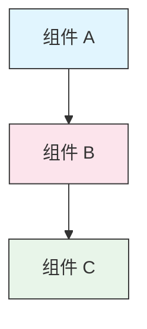

<picture>
  <source media="(prefers-color-scheme: dark)" srcset="resources/logos/claude-howto-logo-dark.svg">
  
</picture>

# 风格指南

> 为 Claude How To 做贡献的约定和格式规则。遵循本指南以保持内容一致、专业且易于维护。

---

## 目录

- [文件和文件夹命名](#文件和文件夹命名)
- [文档结构](#文档结构)
- [标题](#标题)
- [文本格式](#文本格式)
- [列表](#列表)
- [表格](#表格)
- [代码块](#代码块)
- [链接和交叉引用](#链接和交叉引用)
- [图表](#图表)
- [表情符号使用](#表情符号使用)
- [YAML 前置matter](#yaml-前置matter)
- [图片和媒体](#图片和媒体)
- [语气和语调](#语气和语调)
- [提交消息](#提交消息)
- [作者检查清单](#作者检查清单)

---

## 文件和文件夹命名

### 课程文件夹

课程文件夹使用**两位数字前缀**加**kebab-case**描述符：

```
01-slash-commands/
02-memory/
03-skills/
04-subagents/
05-mcp/
```

数字反映从入门到高级的学习路径顺序。

### 文件名

| 类型 | 约定 | 示例 |
|------|-----------|----------|
| **课程 README** | `README.md` | `01-slash-commands/README.md` |
| **功能文件** | Kebab-case `.md` | `code-reviewer.md`、`generate-api-docs.md` |
| **Shell 脚本** | Kebab-case `.sh` | `format-code.sh`、`validate-input.sh` |
| **配置文件** | 标准名称 | `.mcp.json`、`settings.json` |
| **记忆文件** | 范围前缀 | `project-CLAUDE.md`、`personal-CLAUDE.md` |
| **顶级文档** | UPPER_CASE `.md` | `CATALOG.md`、`QUICK_REFERENCE.md`、`CONTRIBUTING.md` |
| **图片资源** | Kebab-case | `pr-slash-command.png`、`claude-howto-logo.svg` |

### 规则

- 所有文件和文件夹名称使用**小写**（顶级文档如 `README.md`、`CATALOG.md` 除外）
- 使用**连字符**（`-`）作为单词分隔符，绝不使用下划线或空格
- 名称保持描述性但简洁

---

## 文档结构

### 根 README

根 `README.md` 按此顺序：

1. Logo（`<picture>` 元素，带深色/浅色变体）
2. H1 标题
3. 介绍性块引用（一句话价值主张）
4. "为什么选择本指南？"部分，含对比表
5. 水平线（`---`）
6. 目录
7. 功能目录
8. 快速导航
9. 学习路径
10. 功能部分
11. 快速开始
12. 最佳实践/故障排查
13. 贡献/许可证

### 课程 README

每个课程 `README.md` 按此顺序：

1. H1 标题（例如 `# 斜杠命令`）
2. 简要概述段落
3. 快速参考表（可选）
4. 架构图（Mermaid）
5. 详细部分（H2）
6. 实践示例（编号，4-6 个示例）
7. 最佳实践（做和不做表）
8. 故障排查
9. 相关指南/官方文档
10. 文档元数据页脚

### 功能/示例文件

单个功能文件（例如 `optimize.md`、`pr.md`）：

1. YAML 前置matter（如适用）
2. H1 标题
3. 目的/描述
4. 使用说明
5. 代码示例
6. 自定义提示

### 部分分隔符

使用水平线（`---`）分隔文档的主要区域：

```markdown
---

## 新主要部分
```

在介绍性块引用之后和各逻辑不同部分之间放置它们。

---

## 标题

### 层级

| 级别 | 用途 | 示例 |
|-------|-----|---------|
| `#` H1 | 页面标题（每文档一个） | `# 斜杠命令` |
| `##` H2 | 主要部分 | `## 最佳实践` |
| `###` H3 | 子部分 | `### 添加技能` |
| `####` H4 | 子子部分（少用） | `#### 配置选项` |

### 规则

- **每文档一个 H1** —— 仅页面标题
- **绝不跳过层级** —— 不要从 H2 跳到 H4
- **保持标题简洁** —— 目标 2-5 个词
- **使用句式大小写** —— 仅首字母和专有名词大写（例外：功能名称保持原样）
- **仅在根 README 标题上添加表情符号前缀**（见[表情符号使用](#表情符号使用)）

---

## 文本格式

### 强调

| 样式 | 何时使用 | 示例 |
|-------|------------|---------|
| **粗体**（`**text**`） | 关键术语、表中的标签、重要概念 | `**安装**：` |
| *斜体*（`*text*`） | 技术术语首次使用、书籍/文档标题 | `*前置matter*` |
| `代码`（`` `text` ``） | 文件名、命令、配置值、代码引用 | `` `CLAUDE.md` `` |

### 用于提示的块引用

使用带粗体前缀的块引用：

```markdown
> **注意**：自 v2.0 起，自定义斜杠命令已合并到技能中。

> **重要**：绝不提交 API 密钥或凭据。

> **提示**：将记忆与技能结合以获得最大效果。
```

支持的提示类型：**注意**、**重要**、**提示**、**警告**。

### 段落

- 保持段落简短（2-4 句）
- 段落之间加空行
- 先说关键点，再提供上下文
- 解释"为什么"而不仅仅是"是什么"

---

## 列表

### 无序列表

使用连字符（`-`），嵌套使用 2 空格缩进：

```markdown
- 第一个
- 第二个
  - 嵌套项
  - 另一个嵌套项
    - 深嵌套（避免超过 3 层）
- 第三个
```

### 有序列表

对顺序步骤、说明和排名项使用编号列表：

```markdown
1. 第一步
2. 第二步
   - 子点详情
   - 另一个子点
3. 第三步
```

### 描述列表

对键值样式列表使用粗体标签：

```markdown
- **性能瓶颈** - 识别 O(n²) 操作、低效循环
- **内存泄漏** - 查找未释放资源、循环引用
- **算法改进** - 建议更好的算法或数据结构
```

### 规则

- 保持缩进一致（每级 2 空格）
- 列表前后加空行
- 保持列表项平行结构（都以动词开头，或都是名词等）
- 避免超过 3 层嵌套

---

## 表格

### 标准格式

```markdown
| 第 1 列 | 第 2 列 | 第 3 列 |
|----------|----------|----------|
| 数据     | 数据     | 数据     |
```

### 常见表格模式

**功能对比（3-4 列）：**

```markdown
| 功能 | 调用方式 | 持久化 | 最适合 |
|---------|-----------|------------|----------|
| **斜杠命令** | 手动（`/cmd`） | 仅会话 | 快速快捷方式 |
| **记忆** | 自动加载 | 跨会话 | 长期学习 |
```

**做和不做：**

```markdown
| 做 | 不做 |
|----|-------|
| 使用描述性名称 | 使用模糊名称 |
| 保持文件专注 | 在单个文件中塞入过多内容 |
```

**快速参考：**

```markdown
| 方面 | 详情 |
|--------|-------|
| **目的** | 生成 API 文档 |
| **范围** | 项目级 |
| **复杂度** | 中级 |
```

### 规则

- 当作为行标签时（第一列）**粗体表头**
- 对齐管道以提高可读性（源文件中可选但推荐）
- 保持单元格内容简洁；详细信息使用链接
- 单元格内对命令和文件路径使用 `代码格式`

---

## 代码块

### 语言标签

始终指定语言标签以进行语法高亮：

| 语言 | 标签 | 用于 |
|----------|-----|---------|
| Shell | `bash` | CLI 命令、脚本 |
| Python | `python` | Python 代码 |
| JavaScript | `javascript` | JS 代码 |
| TypeScript | `typescript` | TS 代码 |
| JSON | `json` | 配置文件 |
| YAML | `yaml` | 前置matter、配置 |
| Markdown | `markdown` | Markdown 示例 |
| SQL | `sql` | 数据库查询 |
| 纯文本 | （无标签） | 预期输出、目录树 |

### 约定

```bash
# 解释命令作用的注释行
claude mcp add notion --transport http https://mcp.notion.com/mcp
```

- 在非显而易见命令前**添加注释行**
- 使所有示例**可直接复制使用**
- 相关时展示**简单和高级**两种版本
- 辅助理解时**包括预期输出**（使用无标签代码块）

### 安装块

使用此模式用于安装说明：

```bash
# 将文件复制到您的项目
cp 01-slash-commands/*.md .claude/commands/
```

### 多步骤工作流

```bash
# 步骤 1：创建目录
mkdir -p .claude/commands

# 步骤 2：复制模板
cp 01-slash-commands/*.md .claude/commands/

# 步骤 3：验证安装
ls .claude/commands/
```

---

## 链接和交叉引用

### 内部链接（相对）

对所有内部链接使用相对路径：

```markdown
[斜杠命令](01-slash-commands/)
[技能指南](03-skills/)
[记忆架构](02-memory/#memory-architecture)
```

从课程文件夹返回根目录或同级：

```markdown
[返回主指南](README.zh-CN.md)
[相关：技能](../03-skills/)
```

### 外部链接（绝对）

使用带描述性锚文本的完整 URL：

```markdown
[Anthropic 官方文档](https://code.claude.com/docs/en/overview)
```

- 绝不使用"点击这里"或"此链接"作为锚文本
- 使用脱离上下文仍有意义的描述性文本

### 部分锚点

使用 GitHub 风格锚点链接同一文档中的部分：

```markdown
[功能目录](#目录)
[最佳实践](#图表)
```

### 相关指南模式

以相关指南部分结尾课程：

```markdown
## 相关指南

- [斜杠命令](../01-slash-commands/) - 快速快捷方式
- [记忆](../02-memory/) - 持久化上下文
- [技能](../03-skills/) - 可复用能力
```

---

## 图表

### Mermaid

对所有图表使用 Mermaid。支持类型：

- `graph TB` / `graph LR` — 架构、层级、流程
- `sequenceDiagram` — 交互流程
- `timeline` — 时间顺序

### 样式约定

使用 style 块应用一致颜色：



**配色方案：**

| 颜色 | 十六进制 | 用于 |
|-------|-----|---------|
| 浅蓝 | `#e1f5fe` | 主组件、输入 |
| 浅粉 | `#fce4ec` | 处理、中间件 |
| 浅绿 | `#e8f5e9` | 输出、结果 |
| 浅黄 | `#fff9c4` | 配置、可选 |
| 浅紫 | `#f3e5f5` | 用户面向、UI |

### 规则

- 使用 `["标签文本"]` 作为节点标签（支持特殊字符）
- 在标签内使用 `<br/>` 换行
- 保持图表简单（最多 10-12 个节点）
- 在图表下方添加简要文字描述以提高可访问性
- 层级使用自上而下（`TB`），工作流使用自左至右（`LR`）

---

## 表情符号使用

### 使用位置

表情符号**少量且有目的**地使用——仅在特定上下文中：

| 上下文 | 表情符号 | 示例 |
|---------|--------|---------|
| 根 README 部分标题 | 类别图标 | `## 📚 学习路径` |
| 技能级别指示器 | 彩色圆圈 | 初级、中级、高级 |
| 做和不做 | 对勾/叉标记 | 做这个、别做这个 |
| 复杂度评级 | 星星 | ⭐⭐⭐ |

### 标准表情符号集

| 表情符号 | 含义 |
|-------|---------|
| 📚 | 学习、指南、文档 |
| ⚡ | 快速开始、快速参考 |
| 🎯 | 功能、快速参考 |
| 🎓 | 学习路径 |
| 📊 | 统计、对比 |
| 🚀 | 安装、快速命令 |
| 🟢 | 初级水平 |
| 🔵 | 中级水平 |
| 🔴 | 高级水平 |
| ✅ | 推荐做法 |
| ❌ | 避免/反模式 |
| ⭐ | 复杂度评级单位 |

### 规则

- **绝不在正文文本或段落中使用表情符号**
- **仅在根 README（而非课程 README）标题上使用表情符号**
- **不要添加装饰性表情符号** —— 每个表情符号都应传达含义
- 保持与上表一致的表情符号使用

---

## YAML 前置matter

### 功能文件（技能、命令、代理）

```yaml
---
name: unique-identifier
description: 功能作用和何时使用
allowed-tools: Bash, Read, Grep
---
```

### 可选字段

```yaml
---
name: my-feature
description: 简要描述
argument-hint: "[file-path] [options]"
allowed-tools: Bash, Read, Grep, Write, Edit
model: opus                        # opus、sonnet 或 haiku
disable-model-invocation: true     # 仅用户调用
user-invocable: false              # 对用户隐藏
context: fork                      # 在隔离子代理中运行
agent: Explore                     # context: fork 的代理类型
---
```

### 规则

- 将前置matter放在文件最顶部
- `name` 字段使用 **kebab-case**
- `description` 保持一句话
- 仅包含需要的字段

---

## 图片和媒体

### Logo 模式

所有以 logo 开始的文档使用 `<picture>` 元素支持深色/浅色模式：

```html
<picture>
  <source media="(prefers-color-scheme: dark)" srcset="resources/logos/claude-howto-logo-dark.svg">
  
</picture>
```

### 截图

- 存储在相关课程文件夹中（例如 `01-slash-commands/pr-slash-command.png`）
- 使用 kebab-case 文件名
- 包括描述性 alt 文本
- 图标用 SVG，截图用 PNG

### 规则

- 始终为图片提供 alt 文本
- 保持图片文件大小合理（PNG 不超过 500KB）
- 图片引用使用相对路径
- 图片存储在与引用文档相同的目录，或共享图片存储在 `assets/` 中

---

## 语气和语调

### 写作风格

- **专业但平易近人** —— 技术准确但不堆砌术语
- **主动语态** —— "Create a file"而非"A file should be created"
- **直接说明** —— "Run this command"而非"You might want to run this command"
- **对初学者友好** —— 假设读者是 Claude Code 新手，但不是编程新手

### 内容原则

| 原则 | 示例 |
|-----------|---------|
| **展示，不讲述** | 提供可工作的示例，而非抽象描述 |
| **渐进复杂度** | 从简单开始，在后面部分增加深度 |
| **解释"为什么"** | "Use memory for... because..."而非仅仅"Use memory for..." |
| **可直接复制使用** | 每个代码块都应在直接粘贴时可用 |
| **真实上下文** | 使用实际场景，而非人为示例 |

### 词汇

- 使用"Claude Code"（而非"Claude CLI"或"the tool"）
- 使用"技能"（而非"custom command"——这是遗留术语）
- 使用"课程"或"指南"指带编号的部分
- 使用"示例"指单个功能文件

---

## 提交消息

遵循 [约定式提交](https://www.conventionalcommits.org/)：

```
type(scope): description
```

### 类型

| 类型 | 用于 |
|------|---------|
| `feat` | 新功能、示例或指南 |
| `fix` | Bug 修复、更正、失效链接 |
| `docs` | 文档改进 |
| `refactor` | 不改变行为的重构 |
| `style` | 仅格式更改 |
| `test` | 测试添加或更改 |
| `chore` | 构建、依赖、CI |

### 范围

使用课程名称或文件区域作为范围：

```
feat(slash-commands): Add API documentation generator
docs(memory): Improve personal preferences example
fix(README): Correct table of contents link
docs(skills): Add comprehensive code review skill
```

---

## 文档元数据页脚

课程 README 以元数据块结尾：

```markdown
---
**最后更新**：2026 年 3 月
**Claude Code 版本**：2.1+
**兼容模型**：Claude Sonnet 4.6、Claude Opus 4.6、Claude Haiku 4.5
```

- 使用月份 + 年份格式（例如"2026 年 3 月"）
- 功能更改时更新版本
- 列出所有兼容模型

---

## 作者检查清单

提交内容前验证：

- [ ] 文件/文件夹名称使用 kebab-case
- [ ] 文档以 H1 标题开始（每文件一个）
- [ ] 标题层级正确（无跳级）
- [ ] 所有代码块有语言标签
- [ ] 代码示例可直接复制使用
- [ ] 内部链接使用相对路径
- [ ] 外部链接有描述性锚文本
- [ ] 表格格式正确
- [ ] 表情符号遵循标准集（如果有的话）
- [ ] Mermaid 图使用标准配色
- [ ] 无敏感信息（API 密钥、凭据）
- [ ] YAML 前置matter 有效（如适用）
- [ ] 图片有 alt 文本
- [ ] 段落简短专注
- [ ] 相关指南部分链接到相关课程
- [ ] 提交消息遵循约定式提交格式
