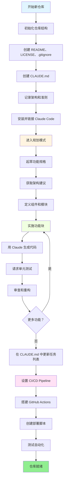
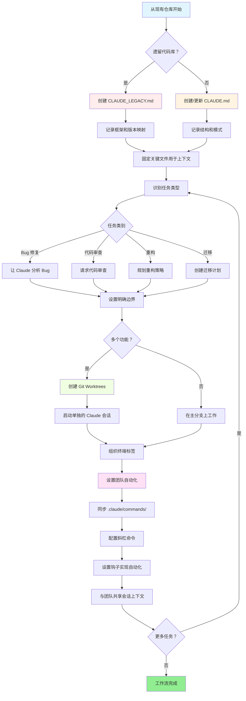

<picture>
  <source media="(prefers-color-scheme: dark)" srcset="resources/logos/claude-howto-logo-dark.svg">
  
</picture>

# 优秀资源列表

## 官方文档

| 资源 | 描述 | 链接 |
|----------|-------------|------|
| Claude Code 文档 | 官方 Claude Code 文档 | [code.claude.com/docs/en/overview](https://code.claude.com/docs/en/overview) |
| Anthropic 文档 | 完整 Anthropic 文档 | [docs.anthropic.com](https://docs.anthropic.com) |
| MCP 协议 | Model Context Protocol 规范 | [modelcontextprotocol.io](https://modelcontextprotocol.io) |
| MCP 服务器 | 官方 MCP 服务器实现 | [github.com/modelcontextprotocol/servers](https://github.com/modelcontextprotocol/servers) |
| Anthropic Cookbook | 代码示例和教程 | [github.com/anthropics/anthropic-cookbook](https://github.com/anthropics/anthropic-cookbook) |
| Claude Code 技能 | 社区技能仓库 | [github.com/anthropics/skills](https://github.com/anthropics/skills) |
| 代理团队 | 多代理协调与协作 | [code.claude.com/docs/en/agent-teams](https://code.claude.com/docs/en/agent-teams) |
| 计划任务 | 使用 /loop 和 cron 的重复任务 | [code.claude.com/docs/en/scheduled-tasks](https://code.claude.com/docs/en/scheduled-tasks) |
| Chrome 集成 | 浏览器自动化 | [code.claude.com/docs/en/chrome](https://code.claude.com/docs/en/chrome) |
| 键绑定 | 键盘快捷键自定义 | [code.claude.com/docs/en/keybindings](https://code.claude.com/docs/en/keybindings) |
| 桌面应用 | 原生桌面应用程序 | [code.claude.com/docs/en/desktop](https://code.claude.com/docs/en/desktop) |
| 远程控制 | 远程会话控制 | [code.claude.com/docs/en/remote-control](https://code.claude.com/docs/en/remote-control) |
| Auto Mode | 自动权限管理 | [code.claude.com/docs/en/permissions](https://code.claude.com/docs/en/permissions) |
| 频道 | 多频道通信 | [code.claude.com/docs/en/channels](https://code.claude.com/docs/en/channels) |
| 语音听写 | Claude Code 语音输入 | [code.claude.com/docs/en/voice-dictation](https://code.claude.com/docs/en/voice-dictation) |

## Anthropic 工程博客

| 文章 | 描述 | 链接 |
|---------|-------------|------------|
| 使用 MCP 进行代码执行 | 如何使用代码执行解决 MCP 上下文膨胀——98.7% token 减少 | [anthropic.com/engineering/code-execution-with-mcp](https://www.anthropic.com/engineering/code-execution-with-mcp) |

---

## 30 分钟掌握 Claude Code

_视频_：https://www.youtube.com/watch?v=6eBSHbLKuN0

_**所有提示**_
- **探索高级功能和快捷键**
  - 定期检查 Claude 在发布说明中的新代码编辑和上下文功能。
  - 学习键盘快捷键以在聊天、文件和编辑器视图之间快速切换。

- **高效设置**
  - 使用清晰名称/描述创建项目特定会话以便轻松检索。
  - 固定最常用的文件或文件夹，以便 Claude 随时访问。
  - 设置 Claude 的集成（例如 GitHub、流行 IDE）以简化编码流程。

- **有效的代码库问答**
  - 向 Claude 询问有关架构、设计模式和特定模块的详细问题。
  - 在问题中使用文件和行引用（例如"解释 `app/models/user.py` 中的逻辑做了什么？它如何与 `src/middleware/auth.ts` 中的中间件集成？"）。
  - 对于大型代码库，提供摘要或清单以帮助 Claude 聚焦。
  - **示例提示**：_"你能解释 `src/auth/AuthService.ts:45-120` 中实现的认证流程吗？它如何与 `src/middleware/auth.ts` 中的中间件集成？"_

- **代码编辑和重构**
  - 使用代码块中的内联注释或请求进行专注编辑（"重构此函数以提高可读性"）。
  - 请求前后对比。
  - 让 Claude 在主要编辑后生成测试或文档以保证质量。
  - **示例提示**：_"重构 `api/users.js` 中的 `getUserData` 函数，使用 async/await 而非 promise。展示前后对比，并为此重构版本生成单元测试。"_

- **上下文管理**
  - 将粘贴的代码/上下文限制为仅与当前任务相关的内容。
  - 使用结构化提示以获得最佳性能（"这是文件 A，这是函数 B，我的问题是 X"）。
  - 在提示窗口中移除或折叠大文件以避免超出上下文限制。
  - **示例提示**：_"这是 `models/User.js` 中的 User 模型和 `utils/validation.js` 中的 `validateUser` 函数。我的问题是：如何在保持向后兼容性的同时添加邮箱验证？"_

- **集成团队工具**
  - 将 Claude 会话连接到团队的仓库和文档。
  - 使用内置模板或为重复工程任务创建自定义模板。
  - 通过与会共享会话记录和提示来协作。

- **提升性能**
  - 给 Claude 清晰、目标导向的指示（例如"用五点概括此类"）。
  - 从上下文窗口中移除不必要的注释和样板。
  - 如果 Claude 输出偏离轨道，重置上下文或重新措辞问题以更好地对齐。
  - **示例提示**：_"用五点概括 `src/db/Manager.ts` 中的 DatabaseManager 类，聚焦于其主要职责和关键方法。"_

- **实用使用示例**
  - 调试：粘贴错误和堆栈跟踪，然后询问可能的原因和修复方法。
  - 测试生成：请求对复杂逻辑进行属性测试、单元测试或集成测试。
  - 代码审查：让 Claude 识别有风险的更改、边缘情况或代码气味。
  - **示例提示**：
    - _"我收到这个错误：'TypeError: Cannot read property 'map' of undefined at line 42 in components/UserList.jsx'。这是堆栈跟踪和相关代码。这是什么原因，如何修复？"_
    - _"为 `PaymentProcessor` 类生成全面单元测试，包括失败交易、超时和无输入的边缘情况。"_
    - _"审查此 pull request diff，识别潜在安全问题、性能瓶颈和代码气味。"_

- **工作流自动化**
  - 使用 Claude 提示编写重复任务（如格式化、清理和重复重命名）的脚本。
  - 使用 Claude 根据代码 diff 起草 PR 描述、发布说明或文档。
  - **示例提示**：_"根据 git diff，创建一个详细的 PR 描述，包含更改摘要、修改文件列表、测试步骤和潜在影响。同时为 2.3.0 版本生成发布说明。"_

**提示**：要获得最佳效果，结合使用这些实践——首先固定关键文件和总结目标，然后使用专注提示和 Claude 的重构工具逐步改进代码库和自动化。

## 与 Claude Code 推荐的配合工作流

### 新仓库推荐工作流

1. **初始化仓库和 Claude 集成**
   - 使用基本结构设置新仓库：README、LICENSE、.gitignore、根配置。
   - 创建描述架构、高级目标和编码准则的 `CLAUDE.md` 文件。
   - 安装 Claude Code 并链接到仓库，用于代码建议、测试脚手架和工作流自动化。

2. **使用规划模式和规格**
   - 在实施功能前使用规划模式（`shift-tab` 或 `/plan`）起草详细规格。
   - 让 Claude 提供架构建议和初始项目布局。
   - 保持清晰、目标导向的提示序列——请求组件大纲、主要模块和职责。

3. **迭代开发和审查**
   - 小块实施核心功能，提示 Claude 进行代码生成、重构和文档。
   - 每次增量后请求单元测试和示例。
   - 在 CLAUDE.md 中维护运行中的任务列表。

4. **自动化 CI/CD 和部署**
   - 使用 Claude 搭建 GitHub Actions、npm/yarn 脚本或部署工作流。
   - 通过更新 CLAUDE.md 并请求相应命令/脚本，轻松调整 pipeline。

#### 现有仓库

1. **仓库和上下文设置**
   - 添加或更新 `CLAUDE.md` 记录仓库结构、编码模式和关键文件。对于遗留仓库，使用 `CLAUDE_LEGACY.md` 涵盖框架、版本映射、说明、bug 和升级说明。
   - 固定或高亮 Claude 应使用上下文的主要文件。

2. **上下文代码问答**
   - 让 Claude 进行代码审查、bug 解释、重构或迁移计划，引用特定文件/函数。
   - 给 Claude 明确边界（例如"仅修改这些文件"或"无新依赖"）。

3. **分支、Worktree 和多会话管理**
   - 使用多个 git worktree 处理隔离功能或 bug 修复，为每个 worktree 启动单独的 Claude 会话。
   - 通过分支或功能组织终端标签/窗口以进行并行工作流。

4. **团队工具和自动化**
   - 通过 `.claude/commands/` 同步自定义命令以实现跨团队一致性。
   - 通过 Claude 的斜杠命令或钩子自动化重复任务、PR 创建和代码格式化。
   - 与团队成员共享会话和上下文以进行协作故障排查和审查。

**提示**：
- 每个新功能或修复以规格和规划模式提示开始。
- 对于遗留和复杂仓库，在 CLAUDE.md/CLAUDE_LEGACY.md 中存储详细指导。
- 给出清晰、专注的指示，将复杂工作分解为多阶段计划。
- 定期清理会话、修剪上下文并移除已完成的工作tree 以避免混乱。

这些步骤捕捉了在新旧代码库中与 Claude Code 顺畅工作流的核心建议。

---

## 新功能和能力（2026 年 3 月）

### 关键功能资源

| 功能 | 描述 | 了解更多 |
|---------|-------------|------------|
| **Auto Memory** | Claude 自动跨会话学习和记忆你的偏好 | [记忆指南](02-memory/README.zh-CN.md) |
| **远程控制** | 从外部工具和脚本编程控制 Claude Code 会话 | [高级功能](09-advanced-features/README.zh-CN.md) |
| **Web 会话** | 通过基于浏览器的界面访问 Claude Code 进行远程开发 | [CLI 参考](10-cli/README.zh-CN.md) |
| **桌面应用** | 带增强 UI 的 Claude Code 原生桌面应用程序 | [Claude Code 文档](https://code.claude.com/docs/en/desktop) |
| **扩展思考** | 通过 `Alt+T`/`Option+T` 或 `MAX_THINKING_TOKENS` 环境变量进行深度推理切换 | [高级功能](09-advanced-features/README.zh-CN.md) |
| **权限模式** | 细粒度控制：default、acceptEdits、plan、auto、dontAsk、bypassPermissions | [高级功能](09-advanced-features/README.zh-CN.md) |
| **7 层记忆** | 托管策略、项目、项目规则、用户、用户规则、本地、Auto Memory | [记忆指南](02-memory/README.zh-CN.md) |
| **钩子事件** | 25 个事件：PreToolUse、PostToolUse、PostToolUseFailure、Stop、StopFailure、SubagentStart、SubagentStop、Notification、Elicitation 等 | [钩子指南](06-hooks/README.zh-CN.md) |
| **代理团队** | 协调多个代理共同处理复杂任务 | [子代理指南](04-subagents/README.zh-CN.md) |
| **计划任务** | 使用 `/loop` 和 cron 工具设置重复任务 | [高级功能](09-advanced-features/README.zh-CN.md) |
| **Chrome 集成** | 使用无头 Chromium 进行浏览器自动化 | [高级功能](09-advanced-features/README.zh-CN.md) |
| **键盘自定义** | 自定义键绑定，包括和弦序列 | [高级功能](09-advanced-features/README.zh-CN.md) |
